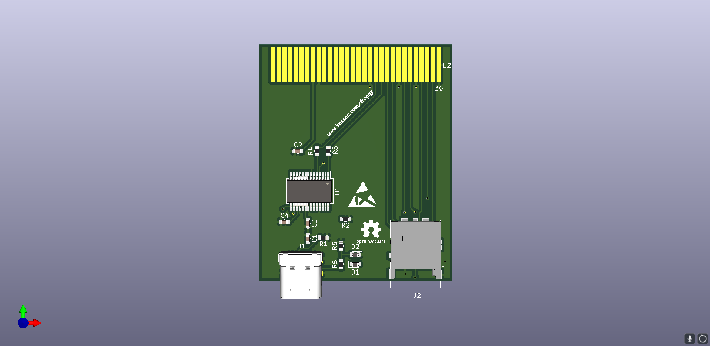
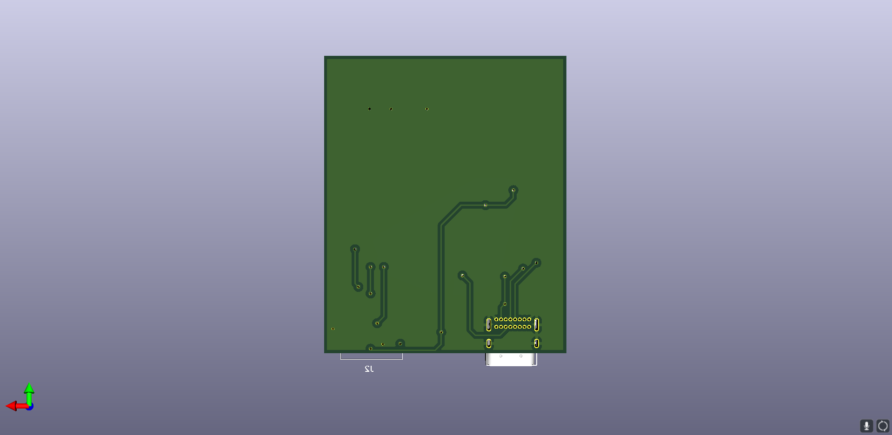

## The Froggy Board
Froggy is a cartidge pinout and expansion board for the Leapfrog Leapster devices. It is cross-compatible with the Leapster Explorer and the GS.

Drivers for the board can be downloaded [here.](https://www.ftdichip.com/Drivers/VCP.htm)

### Features
- Micro-SD support.
- Licensed under the [Solderpad Hardware License v2.1](https://solderpad.org/licenses/SHL-2.1/)
- Virual Serial Port through USB-C.
- FT232RL Based.
- Uses the Kessec-made [Leapster Cartridge Library](https://github.com/kessec/leapster-cart)

